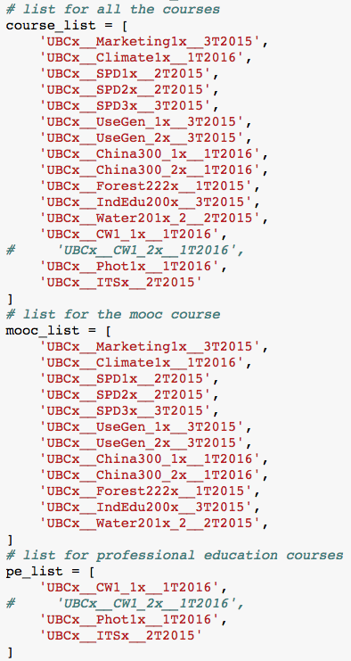
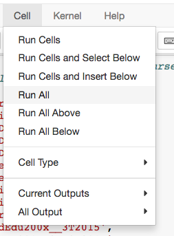
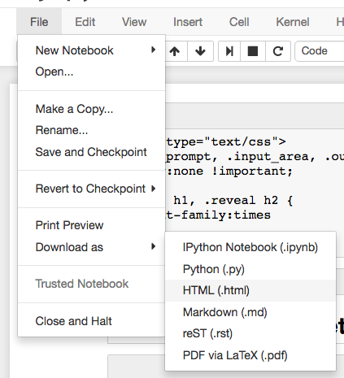

## How to use

To update courses, run the notebook and save as .html:
- for multi_courses: change course_list (for all courses on edX), mooc_list (Moocs) and pe_list (professional education) as needed

 

- for a specific course: change course_id as needed

 

- Cell => Run all

 

- FIle => Download as => Html(.html)

 

If want to present as slideshow:
- multi_courses
~~~
ipython nbconvert multi_courses.ipynb --to slides --template slides_reveal.tpl --post serve
~~~
- a specific course
~~~
ipython nbconvert Climate2015.ipynb --to slides --template slides_reveal.tpl --post serve
~~~
